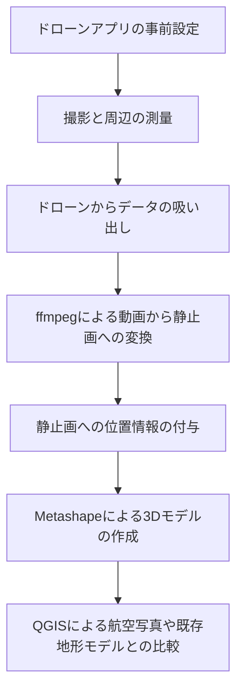

# 準備

## インストールするソフト
- Python 3.8以上
- ffmpeg
- Metashape Professional
- QGIS
- (スマホ上) DJI Fly or DJI GO 4

## アカウントを作成するサービス
- DJIアカウント
- [AIRDATAアカウント](https://airdata.com/)

## pythonで事前にインストールするライブラリ
- pandas
- numpy
- piexif
- opencv-python
- ffmpeg-python

# 概要

ここでは，DJIのドローンからRTK-GPSなしで3Dモデルを作成する方法を説明します．大まかな流れは以下のとおりです．

1. ドローンアプリの事前設定 (やってなくても大丈夫です)
2. 撮影と周辺の測量
3. ドローンからデータの吸い出し
4. ffmpegによる動画から静止画への変換
5. 静止画への位置情報の付与
6. Metashapeによる3Dモデルの作成
7. QGISによる航空写真や既存地形モデルとの比較
8. (精度が足りない場合6に戻って)マーカの設置と再解析

# 概要と諸注意
- このスクリプトはDJI社製のドローンで生成される動画ファイルとメタデータから、3次元位置情報付きの連続写真データを作成するスクリプトです。
    - 今回スクリプト作成時に用いたドローンはDJI Mini 3 Proです。
        - これ以外のドローンでは生成されるメタデータが異なる可能性があります。
    - この位置情報はRTK-GPSなどの精密GNSS測量モジュールとドローンが搭載してない場合には、誤差が大きいです。そのため精度が求められる場合には他の方法で検証するようにお願いします。
    - 現時点では北緯と東経だけ対応しています。南緯、西経は対応していません。
    - 動画ファイルはMP4だけを対象にしていますが、`movie_path = [temp for temp in movie_dir.glob("*.MP4")]`を書き換える事によって、別の動画形式でも可能だと思われます。ただ確認は取れていません。
    - 利用可能なメタデータの種類は2つあります。
        - 1つ目は飛行時に生成されるflightlogをAIRDATAのWebサイトにアップロードすることによって得られるCSVファイルを用いています。
            - こちらは`reference_gnss_data = 0`に相当します。
            - 使用したDJIアプリの言語環境によって得られるCSVファイルの文字コードが変わると思いますので、適宜`csv_data = pd.read_csv(csv_path, encoding="shift-jis")`の箇所を変更するようにしてください
            - フライトログのタイムスタンプと、連続写真のタイムスタンプが異なる場合、フライトログの3次元位置情報(緯度、経度、絶対標高)は線形内挿されることで計算されます。
        - 2つ目は動画ファイルと同時に生成される字幕作成用のSRTファイルを用いる方法です。
            - SRTファイルはテキスト形式であり、動画フレームごとの簡単なメタデータがテキスト平文で記載されています。
            - この平文内に3次元位置情報に関するデータがありますので、それを参照しています。特に補正などはかけていません。

# 使用方法
1. 動画ファイルとCSVファイル、あるいはSRTファイルを用意します。
    - CSVファイルを利用する場合は、CSVファイルへの絶対パスと、動画ファイルが入ったフォルダへの絶対パスを入力してください。
        - 動画ファイルは複数入っていても構いません。ただCSVのタイムスタンプの範囲外を参照した場合、最も近い位置情報(一番初めか一番最後の)がEXIFに入力されます。(例外処理はしていません)
    - SRTファイルを利用する場合は、動画ファイルとSRTファイルが入ったフォルダへの絶対パスを入力してください。
        - 必ず動画とSRTファイルは一対一対応として同一フォルダに入れてください。拡張子以前は同じ文字列にしてください。
2. `Video2Image_setup_sample.py`の中のパラメータを適切なものに書き換えます。
3. 動画ファイルが入ったディレクトリの中に`res`フォルダが作られ、そこに画像が生成されます。