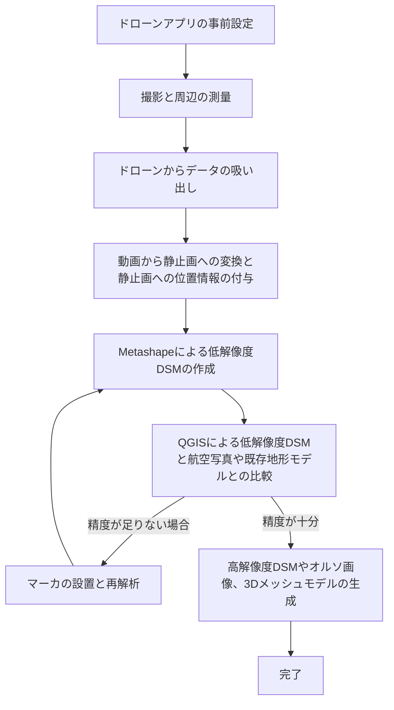

# 準備

## インストールするソフト
- Python 3.8以上
- ffmpeg
- Metashape Professional
- QGIS
- git
- Vidual Studio Code   
- (スマホ上) DJI Fly or DJI GO 4


## アカウントを作成するサービス
- DJIアカウント
- [AIRDATAアカウント](https://airdata.com/)

## pythonで事前にインストールするライブラリ
- pandas
- numpy
- piexif
- opencv-python
- ffmpeg-python

# 概要

ここでは，DJIのドローンからRTK-GPSなしで3Dモデルを作成する方法を説明します．大まかな流れは以下のとおりです．

1. ドローンアプリの事前設定 (やってなくても大丈夫です)
2. 撮影と周辺の測量
3. ドローンからデータの吸い出し
4. 動画から静止画への変換と静止画への位置情報の付与 (このスクリプトの対象)
5. Metashapeによる低解像度DSMの作成
6. QGISによる低解像度DSMと，航空写真や既存地形モデルとの比較
7. (精度が足りない場合) Metashape内での，マーカの位置と重みの調整→5に戻る
8. (精度が十分の場合) Metashape内で，高解像度DSMやオルソ画像，3Dメッシュモデルの生成→完了



# 詳細な手順

## 1. ドローンアプリの事前設定
DJIのドローンでは，動画や画像以外にも様々なデータを記録しています．その中でも，位置情報や姿勢情報は後の3Dモデルの作成に必要な情報です．
こうした情報を取得する方法は2種類あります．

### 1.1. SRTファイルを使う方法 (おすすめ)
DJIのドローンは動画撮影時に字幕を入れることができます．この字幕はSRTファイルとして保存され，動画と同じフォルダに保存されます．
このSRTファイルには，動画の再生時間とともに，その時の**緯度経度高度**などの情報が記録されています．

初期設定ではこの機能はOFFになっているので，DJI FlyやDJI GO 4の設定からONにしてください．

### 1.2. AIRDATAを使う方法
すでに動画をSRTファイルを生成しないで撮影してしまった場合は，AIRDATAなどのフライトログ解析サービスを使うことで，位置情報を取得することができます．

iPhoneの場合，ファイルアプリからDJI Flyのフォルダに入り，`FlightRecord`フォルダにあるCSVファイルを
AIRDATAにアップロードすることで，位置情報を取得することができます．

## 2. 撮影と周辺の測量
ドローンで撮影する際には，いくつかの注意点があります．

- **ファイル形式**
    - 動画と画像のどちらを使うかによって，それぞれのメリット・デメリットがあります．

| 撮影方法 | メリット | デメリット |
| --- | --- | --- |
| 動画 | - 任意の時間で画像として切り出せる<br>- オーバーラップが稼ぎやすい<br>- プレゼン写真としても使える | - 解像度が低い<br>- 位置情報の付与に追加工程が必要 |
| 画像 | - 解像度が高い<br>- RAW画像を使うことで高精度なモデルが生成可能<br>- シャッタースピードが速いためブレが少ない<br>- メタデータに自動的に位置情報が付与されるため手順4と5が不要 | - 後から任意の時間で画像を切り出せない<br>- オーバーラップが稼ぎにくい<br>- 撮影間隔は最短でも1秒であるため，ゆっくり飛ばす必要がある (野外調査では広い範囲をカバーしたいため，相性が悪い) |

- **地上標定点**
    - 対空標識などを持っていない場合でも，道路の白線の端部や，マンホールなど，地上にある標定点を撮影することで，3Dモデルの位置精度を向上させることができます．
    - ある程度精度を向上させるために，単点測位の場合は長め(数分程度)に計測することをおすすめします．
    - また，標定点の位置が後でわかるように，広角と望遠の両方で標定点付近を様々な画角から撮影しておきましょう．
- **撮影の高度**
    - 地上標定点がない場合，複数の高度で撮影することで，3Dモデルの高さ方向の精度を若干向上させることができます．
- **撮影方向**
    - ドーミングと呼ばれる現象 (作成された3Dモデルが弧を描くような形になってしまう) を防ぐために，仰角-90°(完全に真下を向けた状態)に加えて，同じ範囲を若干斜め(仰角-85°)から撮影した画像もあると良いです．
        - これは，建物の側面などの情報が必要な場合にも有効です．

## 3. ドローンからデータの吸い出し
以下の3種類のファイルをドローンから抜き出します．

- 動画ファイル (`*.MP4` or `*.MOV`)
- SRTファイル (`*.SRT`) (存在する場合のみ)
- TXTファイル (`*.TXT`)

### 3.1. TXTファイルの変換

TXTファイルは，DJIのドローンが生成するログファイルですが，暗号化されているため，そのままでは使えません．
このファイルを復号化するために，**Airdata**というサービスを使います．

ログインした後，ファイルをアップロードし，`CSV`ファイルをダウンロードします．

## 4. 動画から静止画への変換と静止画への位置情報の付与 (このスクリプトの対象)

このスクリプトを使うことで，動画から静止画への変換と，静止画への位置情報の付与を行うことができます．

`sample.py`のパラメータの部分を自分の環境に合わせて書き換えてください．

```python
### Parameters (パラメータ) ###
frame_interval = 30     # 何フレームごとに画像を保存するか
start_frame = 0         # 何フレーム目から画像を保存するか
end_frame = 0           # 何フレーム目まで画像を保存するか（0の場合は最後まで）

csv_path = r"PATH_TO_CSV_FILE"      # CSVファイルのパス
movie_dir = r"PATH_TO_MOVIE_DIR"    # 動画ファイルのディレクトリパス

reference_gnss_data = REF_SRT       # GPSデータの参照元（SRTファイル or CSVファイル）
csv_encoding = "shift-jis"          # CSVファイルの文字コード
```

なお，`reference_gnss_data`は以下のいずれかを選択してください．

- `REF_SRT` : SRTファイルを参照する場合
- `REF_CSV` : CSVファイルを参照する場合

このスクリプトを実行することで，`res`ディレクトリに画像が保存され，その画像に位置情報が付与されます．

## 5. Metashapeによる低解像度DSMの作成

Metashapeを使って，生成された連続静止画から3Dモデルを作成します．
ここではタイポイントのみからDSMを作成することによって，低解像度のDSMを作成します．

## 6. QGISによる低解像度DSMと航空写真や既存地形モデルとの比較

QGISを使って，Metashapeで作成したDSMと，航空写真や既存地形モデルとの比較を行います．

## 7. (精度が足りない場合) Metashape内での，マーカの位置と重みの調整→5に戻る

Metashape内で，マーカの位置と重みを調整することで，3Dモデルの精度を向上させることができます．

具体的な精度向上の方法としては，

- 地理院地図の水準点，標高点，測量点などの情報を使う
- ドローンで撮影した画像内の地上標定点の位置情報を使う
- 重みを調整する
- カメラモデルの調整を行う

といった方法があります．

## 8. (精度が十分の場合) Metashape内で，高解像度DSMやオルソ画像，3Dメッシュモデルの生成→完了

Metashape内で，高解像度DSMやオルソ画像，3Dメッシュモデルの生成を行います．